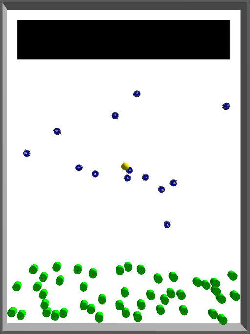
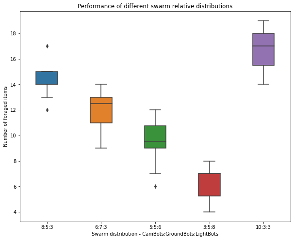
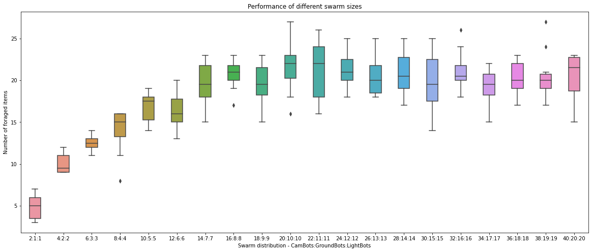

<!-- paginate: false -->
<!-- class: lead -->

# Swarm Intelligence

## Project presentation

---

<!-- paginate: true -->
<!-- class: default -->

## Problem definition

-   Collective foraging in an heterogeneous swarm of robots
-   3 types of robots :
    -   **CamBots** : can see the objects
    -   **GroundBots** : can detect the nest
    -   **LightBots** : can detect light

---

## Proposed solution

-   All robot behaviours modeled as FSMs
-   Static division of labor due to heterogeneous capabilities :
    -   **CamBots** : look for objects and bring them to the nest
    -   **GroundBots** : signal the nest
    -   **LightBots** : signal the light source
-   Control software designed with a swarm of 8 CamBots, 5 GroundBots and 3 LightBots

---

## CamBots behaviour

---

## GroundBots and LightBots behaviour

---

<!-- class: lead -->

# Results

---

<!-- class: default -->

## Flexibility

---

## Scalability

---

## Conclusion

-   Larger swarms do not always yield better results
-   CamBots are the key performance drivers
-   Physical interference is a real problem
-   Reality gap is not faced yet

---

<!-- class: lead -->

# Questions ?
