<!-- paginate: false -->
<!-- _class: lead -->
<!-- footer: "" -->

# RVR : A new robot platform for swarm robotics

 

###### Raffaele Todesco

 

---

<!-- header: Table of contents -->
<!-- paginate: true -->
<!-- footer: "Raffaele Todesco - Master thesis - RVR : A new robot platform for swarm robotics - 2022"-->

1. Introduction
2. The Sphero RVR
3. Simulation
4. Control software
5. Experiments
6. Results
7. Conclusion

---

<!-- header: Introduction -->

#### Objectives

-   Design and implement an architecture for swarm robotics development with the Sphero RVR robot, in order to :
    -   Run virtual experiments with multiple RVRs and design control software within a simulation environment (ARGoS)
    -   Transpose the control software to real robot transparently
    -   Build a modular platform, both on the hardware and software sides
-   Evaluate the quality of existing swarm robotics techniques with this platform, notably automatic design

---

<!-- header: The Sphero RVR -->

#### Hardware architecture

-   Differential treaded robot with a large sensor set :

    -   Ground color sensor
    -   IMU (Accelerometer, magnetometer, gyroscope)
    -   Ambient light
    -   Locator (odometry)

-   Extended with proximity sensors and a lidar

---

<!-- _class: figure -->

#### Hardware architecture

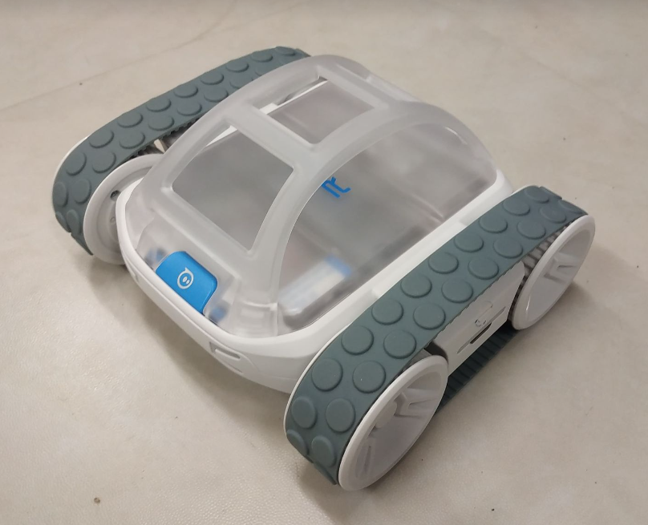
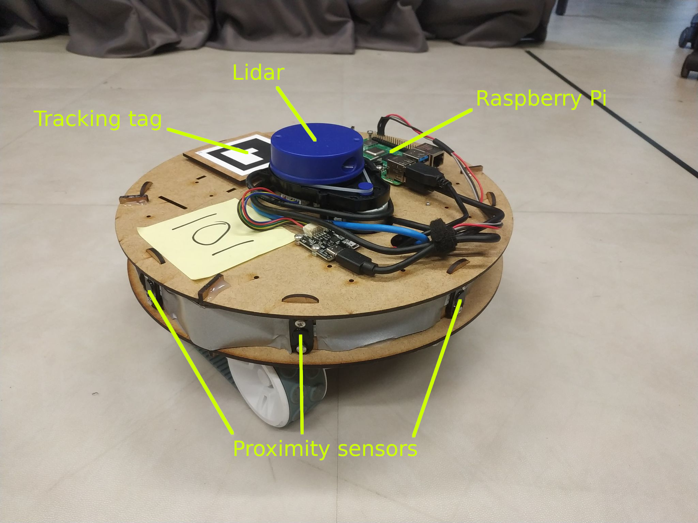

---

#### Software architecture

-   Communication between the robot and the Raspberry Pi is ensured via serial and a dedicated Python API
-   Control software, with the ARGoS simulator, is implemented in C++
-   These two are bridged with ROS, the Robot Operating System

---

#### The Robot Operating System (ROS)

-   ROS is a framework for creating a software infrastructure for robots
-   It works similarly to an RSS feed :

    -   The information is communicated through _topics_
    -   Information sources _publish_ information on topics, which can then be read by _subscribers_
    -   Each component (subscriber or publisher) is a _node_

-   ROS enables communication between the robot API and the control software

---

#### Software architecture

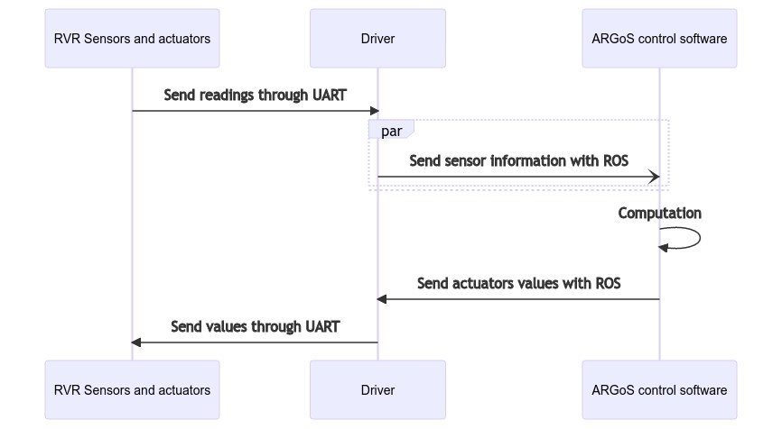

---

#### Additional components

-   External sensors are running their own node, requiring no additional work for their integration

-   A color labeling node has been implemented to identify color labels more reliably

---

#### Software architecture

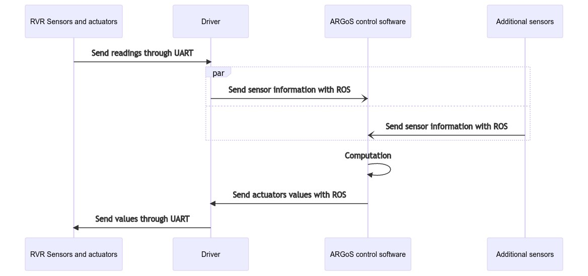

---

<!-- header: Simulation -->
<!-- _class: figure -->

#### Simulation

-   Simulation is a key part of the development process, to allow offline design, repeatability, reproducibility and testing
-   The simulation is implemented in ARGoS, a physics-based simulation environment designed for swarm robotics applications
-   A 3D model of the robot has been designed

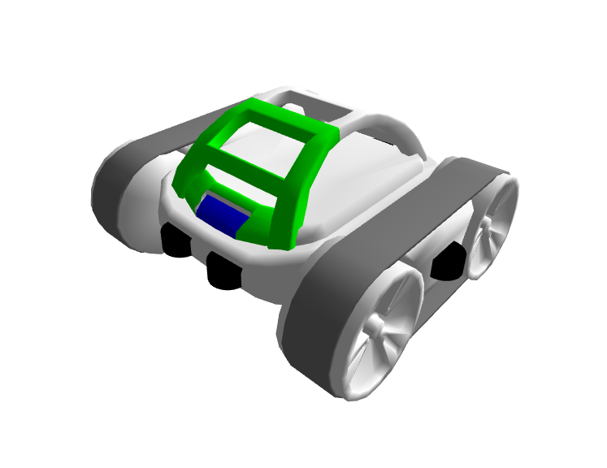

---

#### Simulating sensors

-   Each of the robot's sensors is simulated in ARGoS
-   The noise of the sensors is evaluated with the real robot and generated similarly in the simulation
-   I will only go over the sensors that were in use for this thesis experiments

---

<!-- header: Control software -->

#### Control software

-   The control software defines the behavior of the robot
-   To run experiments, the control software has to be designed by humans or in an automatic fashion
-   Automatic modular design is less time-consuming and more efficient than human experts
-   The control software comprises 2 layers :
    -   The reference model
    -   The control software

---

#### The reference model

-   The reference model is a model of the robot's behavior, as input/output variables
-   It allows an additional layer of abstraction between the control software and the robot
-   Provides sensor data as well as extracted features, such as the neighbour positions computed with the lidar readings

---

#### Example use of the reference model

-   Robots in reality detect neighbours with the lidar
-   ARGoS, for physics simulation reasons, can not simulate it and uses virtual beacons
-   Both provide the relative positions of the neighbours and provide it as an input to the control software through the reference model

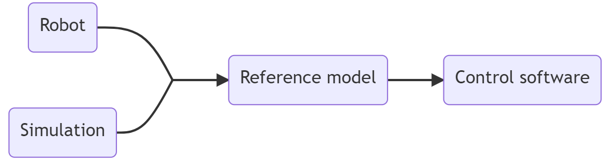

---

#### AutoMoDe control software

-   AutoMoDe is an automatic modular control software design process for swarm robotics
-   It assembles predefined behaviours and transitions modules as a Probabilistic Finite State Machine (PFSM)
-   Several versions (named flavours) of AutoMoDe exist, each with different modules, optimization algorithm, form of the control software, etc.
-   All of them are designed for the e-puck robot

---

#### AutoMoDe-_Watermelon_

| Behaviours  |       Transitions        |
| :---------: | :----------------------: |
| Exploration |       Black floor        |
|    Stop     |       White floor        |
| Attraction  |        Gray floor        |
|  Repulsion  |     Neighbour count      |
|             | Inverted Neighbour count |
|             |    Fixed probability     |
|             |     Color detection      |

---

<!-- header: Experiments -->

#### Experiments

-   4 experiments are conducted with a swarm of 3 robots :
    -   Modules assessment
    -   Aggregation
    -   Grid exploration
    -   Color selection
-   The 3 last experiments last 120 seconds

---

#### Modules assessment

-   Each _Watermelon_ module is evaluated to assess that the building blocks are working as expected
-   Also allows to find the discrepancies between simulation and reality early

---

<!-- _class: figure -->

#### Aggregation

-   The robots have to aggregate on a black spot at the center of the arena
-   Objective function is the number of robots on the black spot at the end of the experiment

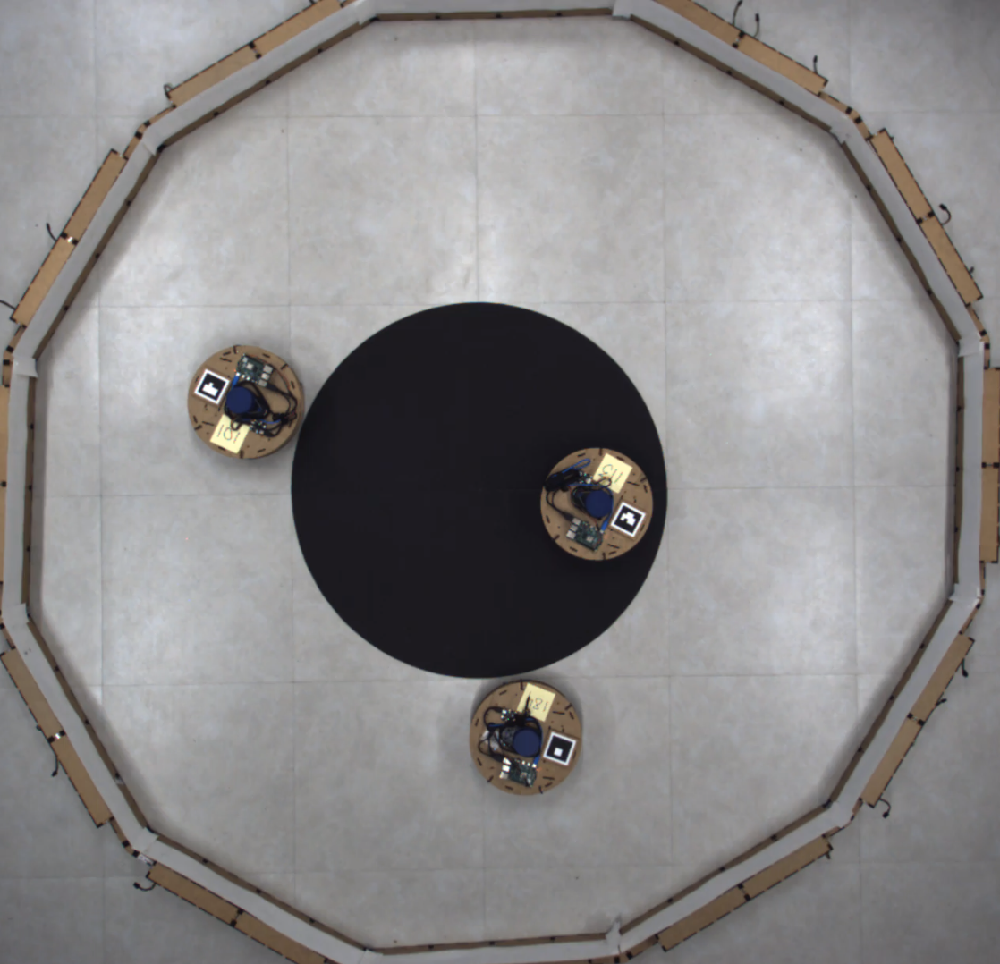

---

<!-- _class: figure -->

#### Grid exploration

-   The robots have to explore the arena, which is divided in a virtual grid
-   Objective function is measured by the cumulated time, for each tile, since it was last visited by a robot
- $$ F = -\frac{1}{N_{tiles}}\sum_{i=1}^{N_{cc}} \sum_{j=1}^{N_{tiles}}t_{ij} $$ 

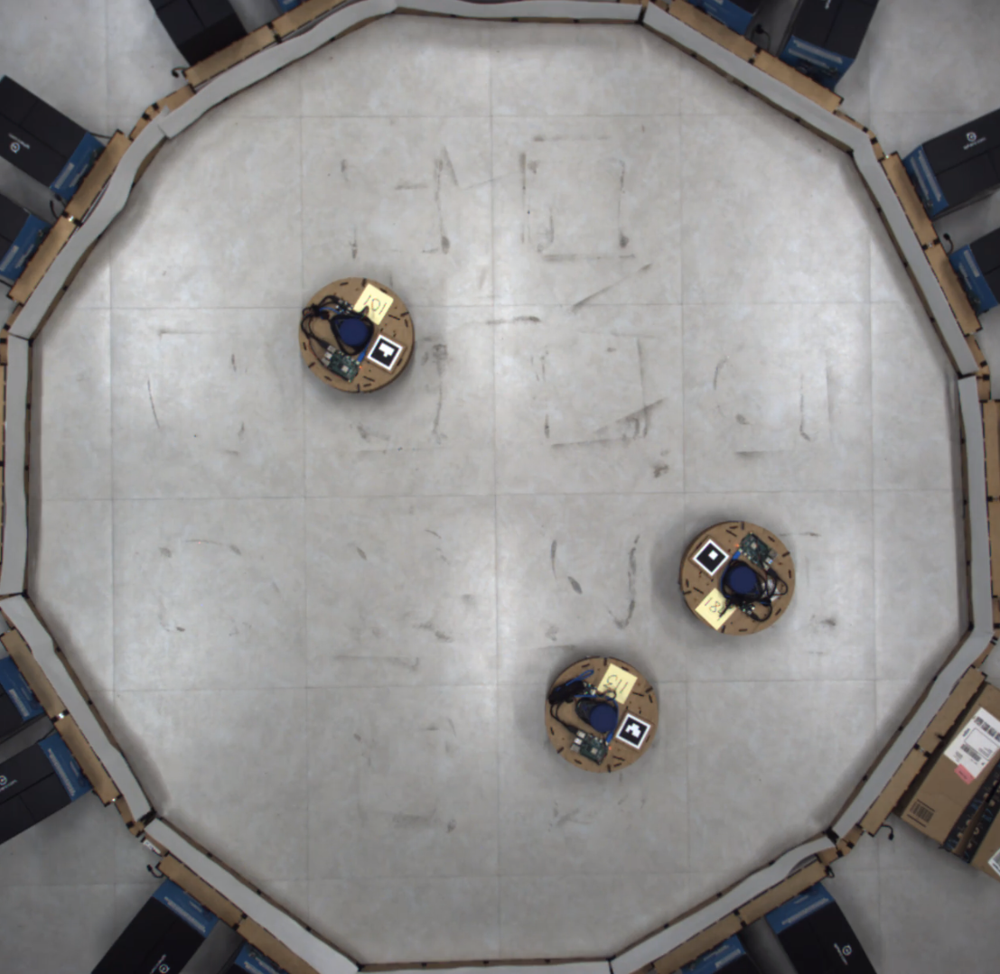

---

<!-- _class: figure -->

#### Color selection

-   The robots have to stand on the color that rewards the most at the end of the experiment
-   Objective function is the cumulated reward obtained by each robot
- $$ F = \sum_{i=1}^{N} \sum_{j=1}^{N_{colors}}r_{j}b_{ij} $$ 

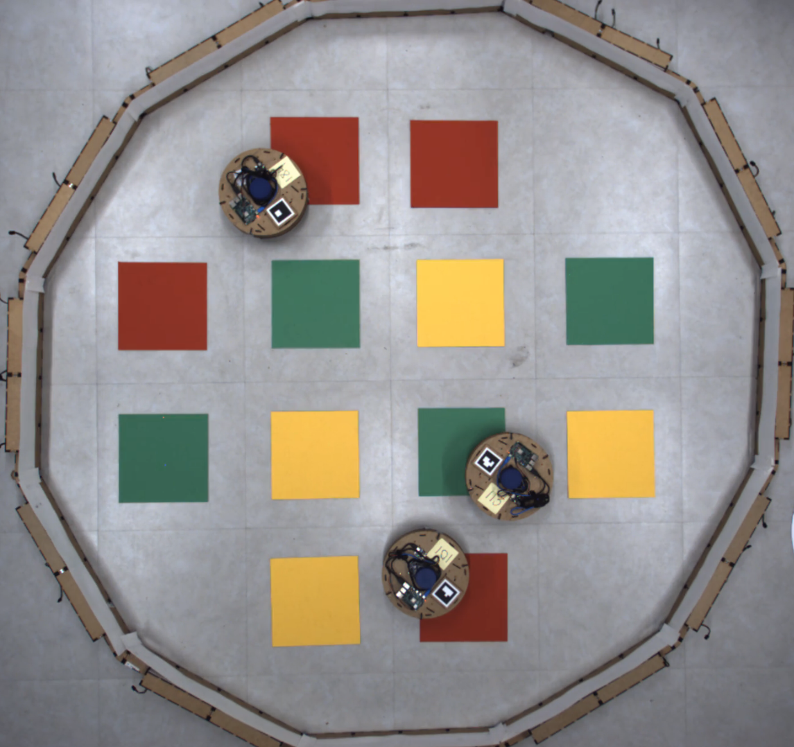

---

<!-- header: Results -->

#### Modules assessments

- All _Watermelon_ modules work as expected
- The discrepancies between simulation and reality are :
   - Latency
   - Obstacle detection
   - Neighbour detection
   - Timestep duration

---
<!-- _class : figure -->
#### Aggregation

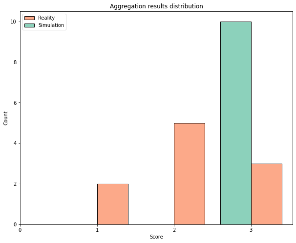

---
<!-- _class : figure -->
#### Grid exploration

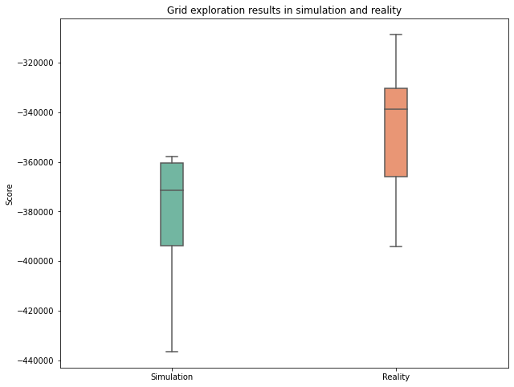

---

<!-- _class : figure -->
#### Color selection

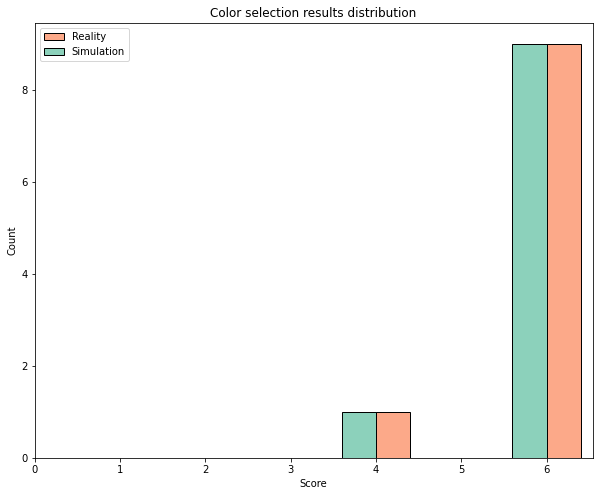

---

<!-- header: Conclusion -->

#### Conclusion

-   The RVR is a suitable platform for research in swarm robotics 
-   Existing techniques such as automatic design are successfully ported to the RVR
-   The modules should be redesigned to take full advantage of the RVR platform