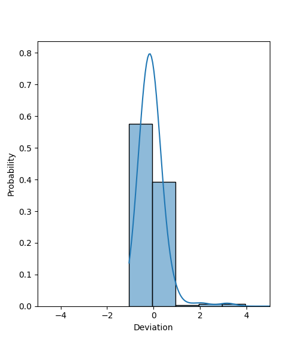
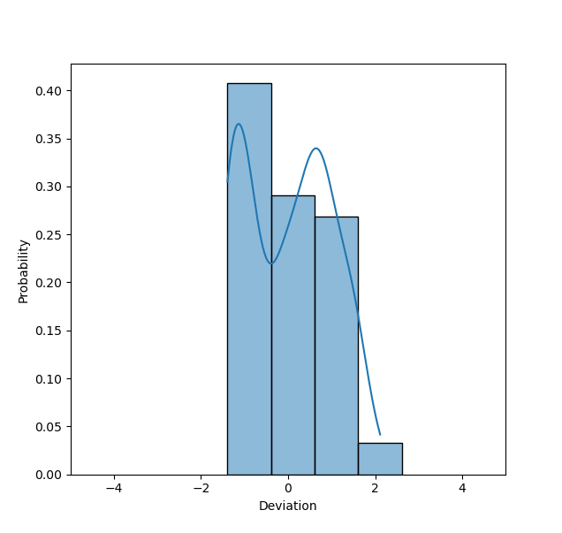

<!-- paginate: false -->
<!-- _class: lead -->
<!-- footer: "" -->

# RVR : A new robot platform for swarm robotics

 

###### Raffaele Todesco

 

---

<!-- header: Table of contents -->
<!-- paginate: true -->
<!-- footer: "Raffaele Todesco - Master thesis - RVR : A new robot platform for swarm robotics - 2022"-->

1. Introduction
2. The Sphero RVR
3. Simulation
4. Control software
5. Experiments
6. Results
7. Conclusion

---

<!-- header: Introduction -->

#### Objectives

-   Design and implement an architecture for swarm robotics development with the Sphero RVR robot, in order to :
    -   Run virtual experiments with multiple RVRs and design control software within a simulation environment (ARGoS)
    -   Transpose the control software to real robot transparently
    -   Build a modular platform, both on the hardware and software sides
-   Evaluate the quality of existing swarm robotics techniques with this platform, notably automatic design

---

<!-- header: The Sphero RVR -->

#### Hardware architecture

-   Differential treaded robot with a large sensor set :

    -   Ground color sensor
    -   IMU (Accelerometer, magnetometer, gyroscope)
    -   Ambient light
    -   Locator (odometry)

-   Extended with proximity sensors and a lidar

---

<!-- _class: figure -->

#### Hardware architecture

---

#### Software architecture

-   Communication between the robot and the Raspberry Pi is ensured via serial and a dedicated Python API
-   Control software, with the ARGoS simulator, is implemented in C++
-   These two are bridged with ROS, the Robot Operating System

---

#### The Robot Operating System (ROS)

-   ROS is a framework for creating a software infrastructure for robots
-   It works similarly to an RSS feed :

    -   The information is communicated through _topics_
    -   Information sources _publish_ information on topics, which can then be read by _subscribers_
    -   Each component (subscriber or publisher) is a _node_

-   ROS enables communication between the robot API and the control software

---

#### Software architecture

---

#### Additional components

-   External sensors are running their own node, requiring no additional work for their integration

-   A color labeling node has been implemented to identify color labels more reliably

---

#### Software architecture

---

<!-- header: Simulation -->
<!-- _class: figure -->

#### Simulation

-   Simulation is a key part of the development process, to allow offline design, repeatability, reproducibility and testing
-   The simulation is implemented in ARGoS, a physics-based simulation environment designed for swarm robotics applications
-   A 3D model of the robot has been designed

---

#### Simulating sensors

-   Each of the robot's sensors is simulated in ARGoS
-   The noise of the sensors is evaluated with the real robot and generated similarly in the simulation
-   I will only go over the sensors that were in use for this thesis experiments

---

#### Ground color sensor

<!-- _class: figure -->

-   The ground color sensor provides the color of the ground under the robot
-   The reading is a Red Green Blue (RGB) triplet
-   The sensor undergoes a Gaussian noise

<!--  -->

---

<!-- _class: figure -->

#### Proximity sensors

-   The proximity sensors cast rays from the robot to the environment to detect obstacles
-   If the distance between the robot and closest obstacle is in the sensor range, it constitutes the reading
-   The sensor undergoes a Gaussian noise

---

<!-- _class: figure -->

#### Lidar

-   The lidar is a long-range sensor that detects the distance to obstacles similarly to the proximity sensors
-   The sensor undergoes a uniform noise

